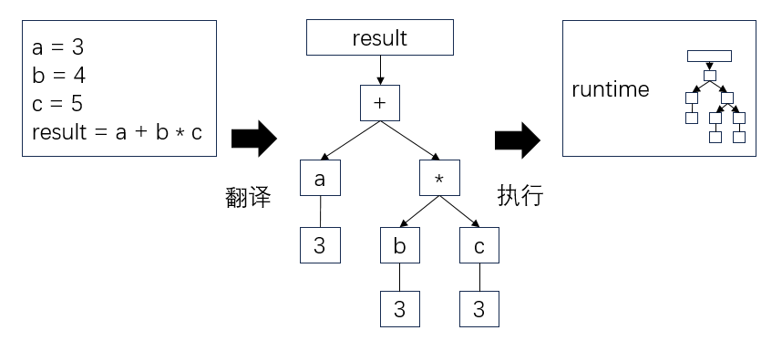

# 编程语言
> **阅前须知**：本文档**不针对任何特定语言**，主要描述对象为接近 oop 的语言（类似 Js、Python、Java、C#、Cpp 等）。  
> 如果你指望在这里学到某门语言的具体用法，那就大错特错了。  
> 关于**某门特定编程语言**的速成，推荐到**菜鸟教程**去查看。这里是小学教材，不能替代幼教过程。  

一门编程语言都不会的小朋友，一定要去至少了解一门再来也不迟：  
[菜鸟教程 runoob.com](https://www.runoob.com/)

本文档有一个不切实际的希望：看完之后，每当你面对一门新语言，你都应当能猜出大多语言的设计——没错，举一反三的要诀是**猜**而不是**查**或**背**，100 个问题中，有 90 个都得猜出来，否则会累死人。  

国内编程语言的课大多又臭又长，翻来覆去就讲语法。好一些的会带上编译过程、执行过程的解释——但都太冗长。  
要想做到**不被语言拖累**，三天上手新语言的水平，我们需要在学语言之前了解编程语言的大概结构：  

- code 文本代码
- parser 语法分析器
- runtime 运行时环境

在文本框中输入代码，parser 负责将**文本代码**翻译为语法树 AST，最后运行时环境（runtime、进程）负责执行 AST。  
  
> 所以，当我们说编译器报错、运行时报错，你至少得知道是**哪个环节**出了问题。  

我们重点关心语法语义层面 **（代码层）** ，只会少量碰到 parser 和 runtime。  

## 开始写代码
程序的定义是**为执行特定任务，经过数据输入，计算后，输出结果**的过程。  
你写的代码，算程序；广义说，法院的流程，也算程序。

所有语言都能找到输出用的方法（函数）。大部分叫`print`，也有叫`out`，甚至有`console.log`，还有更奇怪的。  
总之，拿到一门新语言，请你先去找到它的I/O接口（函数），并稍微关心它是输出到哪儿的（有些甚至输出到浏览器的控制台）。  

## 1·表达式 expression、左右值 l-value r-value、返回值 return value

### 表达式 expression
表达式是由常量、变量、运算符或函数等组成的语句，它能产生一个值，也可以不产生。  

比方如下表达式：`a + b`和`1 + 1`可以产生一个值，结果为它们值的加法运算。而`fun()`则不一定产生值，毕竟这个函数可以返回**空**（或不发生返回行为）。  

### 左右值 l-value r-value
左右的划分是以赋值符号（一般为`=`）为基准来的，顾名思义，左侧是左值，右侧是右值。  
```c
a = 3 + sin(20);
```
> **左值（L-value）** 一般是可修改的变量或对象。在 **（相对）低级语言** 中指向一个实际存储数据的地址。**右值（R-value）** 可以是常量、表达式的结果等，它们只能出现在赋值语句的右边，你可以认为它们是**临时性的**。  

并非所有编程语言都严格区分左右值，但许多低级语言和编译型语言（如C、C++）都有这种设计。在这些语言中，左右值的区分主要源于内存管理和变量赋值的需求。而在一些高级语言（如Python、JavaScript），左右值的概念不是显式的，但依然有其隐含的行为。  

左右值在**低层次内存管理有关的语言中是一种有益的抽象**。
随着**现代编程语言**的**抽象化和高级化**，严格区分左右值的设计在某些语言中可能显得**冗余**，许多高级语言更关注业务逻辑的简洁性，而不是对底层内存的显式控制。  

**让你了解左右值——这个编程语言的设计概念，仅仅是为了利于你在上手一门新语言是来得更容易，不要抓耳挠腮——而不是让你当语言警察四处出警喷群友。**  

### 返回值 return value
现在你应该明白了，表达式能返回值。把某些表达式置于赋值号`=`的右侧，算是一种基操。甚至很多表达式的设计，就是为了让你方便将它当作右值用的（哪怕右值在该语言中是个伪概念）。  

因此下面不再啰嗦所有关于**返回值**相关的讨论。

## 2·条件分支 if

`if` 一般分两种，你能在大部分语言里找到下面两种用法。    

正常 if：
```js
if (contition) {}
else {}
```
三目表达式，简化了 if，用于只返回值的条件分支：  
```js
condition ? value1 : value2 // 如果条件为真，返回 value1，否则返回 value2
```
比方这样：`message = (score > 60) ? '你及格' : '不及格';`

## 3·循环 for 和迭代器

`for` 一般分几种。  

**三段式 for**：
* 大部分语言
```js
for(i = 0; i < n; i++) {}
```

**迭代器 for**:
* js
```js
for(one of something) {}
```
* js python swift ... 
```swift
for(one in something) {}
```
* 神秘语言
``` java
for one : something {}
```
* c++11
```cpp
for(auto i : something) {}
```
这些写法太多了，但大致有如下特点：  
- 三段式：**初始化、条件、迭代**，然后循环往复。  
- 迭代器：每次从 something 中取出一个 one，然后循环往复。  

三段式太简单了，我们看下for迭代器的用法。

### 迭代器是什么？  
一般来说，迭代器是 **数据结构（又叫“容器类”、“集合类”）** 自带的东西。它提供了一种访问容器内部元素的方法，而无需暴露该容器的内部结构。迭代器同通常提供下面两种核心方法：  

- ` next()`：返回集合中的下一个元素。
- `hasNext()` 或 `isEnd()`：判断是否还有下一个元素可以返回。

> 在算法层面，我们叫它**数据结构**；在语言的文档里，我们叫**容器类**、**集合类**。层次不同，叫法不同。  

<center style="border: 2px solid red; font-size: 20px; margin: 20px; padding: 20px;"><b>💀💀如果你大致知道容器/集合类，可以跳过了。下面是为新手讲的，非常啰嗦。💀💀</b>
</center>

你应该见过以下容器：
- 数组、列表 list、array
- 映射 map
- 集合 set

如果没见过，赶紧去搜索引擎见见。  
你会经常用到这些容器类，比方：
```js
myArray = [1, 2, 3];
myMap = {'Math': 98, 'English': 54};
```

这些**用不同方式组织起散的数据**的东西叫容器，之所以他们不散，是因为他们都**被某种东西连接起来了**。  
链接它们的就是**迭代器（iterator）**。  
对于某容器 a，你往往能通过`a.begin()`拿到它的首个迭代器，访问它的元素内容和相关信息。然后通过`a.next()`拿到它的下一个元素，直到末尾。  
这个过程叫**迭代（iteration）**。
```js
a = [1, 'two'];
it = a.begin(); print(it.value()); 
// 1
it = it.next(); print(it.value()); 
// 'two'
```
像数组的迭代器顺序，有实际意义，和数组顺序有关。对于许多无序容器，则不必多考虑迭代器顺序意义——**它只是纯粹给你串起来，方便你用 for 遍历的**。  

### 迭代器 for 遍历

这是好文明，得多用。既好看，又易懂，还能吃上语言的各种优化buff（比如运行时优化或编译优化）。  
比如我们把自己的成绩改及格：  
```js
myMap = {'Math': 98, 'English': 54};
for(let score of myMap) {
    if(score.value < 60)
      score.value = 60
}
```

**至此，别再动不动用三段式了。迭代器更多时候符合人类自然语言习惯。还有，你不该再看不懂任何语言关于 for 的代码了——至少得大致猜出它在干什么。**

## 4·函数 function
函数就像**机器**：你给它一些输入，它会吐出结果。比如你最喜欢的三角函数 `sin(x)`，输入 `x`，它会返回 `y`，这就是输出。函数名就是机器的名字，`x` 是你给机器的原料（**参数**），`y` 是机器处理后的产品（**返回值**）。

```js
function add(x, y) {
  return x + y; 
}
```

### 匿名函数 anonymous function
匿名函数是**没有名字的机器**，你只用一次，所以不用起名字。这种函数特别灵活，用完即走。

```js
(x, y) => { return x + y } // js
{ (a: Int, b: Int) in a + b } // swift 直接返回单句表达式值，省略 return
```

### Lambda 表达式
Lambda 就是匿名函数的另一种写法，通常更简洁。很多语言里都有这种方便写法，直接拿来用。**注意：它是表达式，不能直接调用，你也许想到了可以将它的值塞在`=`的右边……**  

```js
(x, y) => x += y // js 直接返回单句表达式值，省略 return
[&x](int y) -> int { x += y; } // c++
```

### 闭包 closure
闭包就是**记住环境的函数**。它会把外部的变量“锁”在自己的记忆（context 上下文）里，哪怕这些变量已经不在其它地方存在了，闭包仍然可以使用它们。

```js
function outer() {
  let name = "小明";
  return function() {
    console.log("你好，" + name);
  };
}
const greeting = outer();
greeting(); // 输出：你好，小明
```

**你用函数的方式更灵活了，之后就不要抱怨看不懂人家的代码了。**

## 5·类 class、对象 object

### 生命周期

大学里教 oop（面向对象）的时候又臭又长，还让背一堆概念。实际上，多数时间我们只聚焦于一件事情：**对象的生命周期**。  

其余的事情，等你需要用到，再去搜都不迟。  

有一类对象（言下之意，除了内容，对象们的形式一致）需要被描述。于是需要写它的**类 class**：

```cpp
// c++
class MyClass {
  std::string name; // 成员 成员属性
  void hello() { printf("Hello I'm %s.\n", name); } // 成员 成员函数 成员方法
  MyClass(str_name): name(str_name) {} // 构造器 构造函数 constructor
  ~MyClass() { printf("I'm dead.\n") } // 析构器 析构函数 destructor
}
```

有了类，你通过它的**构造函数**可以用它生产一大批同类对象 object：  
```cpp
auto Tom = MyClass("Tom");
auto Bob = MyClass("Bob");
```
在这里使用了构造函数，**构造函数是一个对象的生命开端**，负责处理初始化。如果某次 bug 中你很无辜地说：明明我都没动手，这对象自己出了问题——**别忘了去查一下构造器**。  

> 构造函数的设计在不同语言都不一样，例如 python 使用了约定的 `__init__()`， cpp 和 java 使用了**和类同名的函数**，js 使用了 `constructor()`……无论如何，都是为了在对象**初始化**时做些动作的（清零、配置等初始化）。


生命周期的中途，你还会使用它的成员函数（方法），或成员变量（属性）：  
```cpp
Tom.hello();
std::string a_cool_name = Tom.name;
```
因此，**成员**一般是在生命周期中拿来使用的。无论是**成员方法/函数**还是**成员属性/变量**。

最后 Bob 和 Tom 可以死了，我们得销毁他俩。  
其实一般都不用你手动做，比如：
```cpp
void TomAndBobsLife() {
  auto Tom = MyClass("Tom");
  auto Bob = MyClass("Bob");
  ...
} // 离开该作用域时，Tom 和 Bob 会被 RAII(Resource Acquisition Is Initialization) 自动销毁
int main() {
  TomAndBobsLife();
  return 0;
}
```
好了，接下来的代码它们再也不会活过来了。**析构函数**负责处理销毁，它会在对象被销毁时自动调用。在这里体现为被`TomAndBobsLife()`该函数通过RAII销毁掉`Tom`和`Bob`并回收资源（内存）。

现在大概知道什么是类和对象了吗？你可以参考柏拉图的**理念论**一说，来理解它的希腊哲学来源。

> 木匠在制作床之前，他的脑中都会事先存在**设计图**，这个设计图就是 **“类”**，它定义了床的所有特征和功能。而每一张 **真实的床（实例）** ，每张床都是一个 **“对象”**。

**展示完之后，我们绝不是希望你全流程手动控制对象的生命周期！皇帝也是人，一个皇帝控制每个公民的命运，这个国家吃枣药丸的！！**  
**相反，你应该尽力避免 cpp 的手工控制对象生命周期（资源回收）这类事情（如果你是老手自然就知道要用一定的模式和技巧去管理动态内存）。**

### 坑点

上面之所以用 cpp 举例，是因为 cpp 最繁琐，暴露的细节足够多。  
然而，哪怕像 java 这么老的语言，都不希望你去操作析构函数（内存回收），java 认为 jvm（java 的虚拟机）应该用一定的算法流程（gc garbage collection 垃圾回收）帮你做好这件事——很多 cpp 小宝宝会把代码写炸，乃至炸穿服务器，带来若干严重损失。

> 如果是政治学理论，兴许我们还要讨论一下伦理学；但这里是编程语言的手册，我们只讨论风险和效率。

现代语言都认为，对象的生命周期应当由 runtime 解决，而不是你这个 coder 皇帝亲自动手——就像是地方事务应该交给地方长官，而不是累死罗马皇帝。于是我们看到了以下分层：

- 业务层/任务层：你的代码写在这里，专注于你的业务/任务
- runtime 层：运行时会提供所有**设计者认为的**必要支持（比如垃圾回收、协程控制）

### 隐式转换
你可能在代码中遇到这样的情况：一个变量的类型变了，程序还能正常运行。这就是**隐式转换**在发挥作用。

**隐式转换**，也称为**自动类型转换**，是指编程语言在需要时自动将一种数据类型转换为另一种兼容的数据类型，而无需显式地进行转换。

有的语言是**强类型**的（如 Python），有的语言是**弱类型**的（如 JavaScript）。隐式转换的存在，与语言的类型系统设计密不可分。

**强类型语言**通常更严格，类型不兼容时会报错 ，但它在某些情况下确实允许有限的隐式转换。而**弱类型语言**更灵活，允许更多的隐式转换。

**例如**：

```python
print('5' + 3)  # TypeError: can only concatenate str (not "int") to str
```

在 Python 中，字符串和整数的加法会报错，因为它不进行隐式转换。而在 JavaScript 中：

```python
console.log('5' + 3);  // 输出 '53'
```

JavaScript 将整数 `3` 隐式转换为字符串 `'3'`，结果是字符串拼接。这种行为可能导致难以察觉的错误。

隐式转换带来了便利，但也可能引发**意外的错误**。

**例如**：

你有一个函数，需要接收一个参数 `value`，如果没有提供该参数，或参数为 `None`，则使用默认值 `default_value`。然后你偷懒用了 `or`：

```python
def process_value(value=None):
    default_value = 10
    final_value = value or default_value
    print(f"The final value is: {final_value}")
```

然后你就会得到

```python
process_value(5)    # 输出：The final value is: 5
process_value() 	# 输出：The final value is: 10
process_value(0)    # 输出：The final value is: 10
```

期望0却得到了10

当你用 `value or default_value` 时，Python 会将 `value` 隐式转换为布尔值以判断其真值。

**如果 `value` 为 `0`，就被视为假值**，因此 `final_value` 被赋值为 `default_value`，即 `10`

隐式转换是编程语言中的一把双刃剑。它在提高编码效率的同时，也可能带来隐患。

## 6. 同步 & 异步
你知道吗？为什么新手在写程序时最常用的**键盘输入**会使程序停下来，而不会哗哗哗往下继续跑？

因为你写的是**同步程序**。在同步程序中，**每条语句都要等待上一条语句执行完毕**，才能执行下一条语句。而**键盘输入**属于**I/O操作（Input/Output Operation）**，IO 会阻塞程序的执行——直到输入完成。

可以作如下简单理解：同一台机器的执行顺序是可预测的，而外部影响是不确定的。一旦某个程序要接受外界影响（典型的是网络操作），它的执行效果便不是自己说了算的了。
```py
a = input()
b = network_recive(url = 'https://example.com', type =  'int', len = 1)
c = a + b
print(c)
```
以上代码中，如果网络发送回的数据`b`先到，但程序卡在键盘输入`a`迟迟不推进，则`b`永远不被更新。

我们仍未知道那天是键盘输入的`a`先到来，还是网络对面的`b`先发送过来。这导致程序总会卡在 a b 其中一处。把这类操作变得复杂，如数据请求、流式数据传输、数据库访问和操作等，再扩大若干倍，事情将会失控。

所以，异步的方法诞生了。异步指**允许某些操作不等待结果，继续执行下一条语句**，直到结果返回。
```py
async def network_recive(url):
  ...
  return result
a = input()
b = await network_recive(url = 'https://example.com')
c = a + b
print(c)
```
以上代码无论是网络数据先发送回来，还是键盘先输入，都可以执行到`c=a+b`，而无需因顺序要求浪费一次等待。

如之前所说，使用异步时，无需关心 runtime 如何处理它，只需关注业务逻辑即可。在多数主流语言中，异步的使用需要你关心两处：

- 定义异步函数：在函数开头加`async`关键字
- 调用异步方法：在调用前加`await`关键字

其余写法不变，最大限度简化了重构、维护、扩展代码的工作量

## 7. 并发